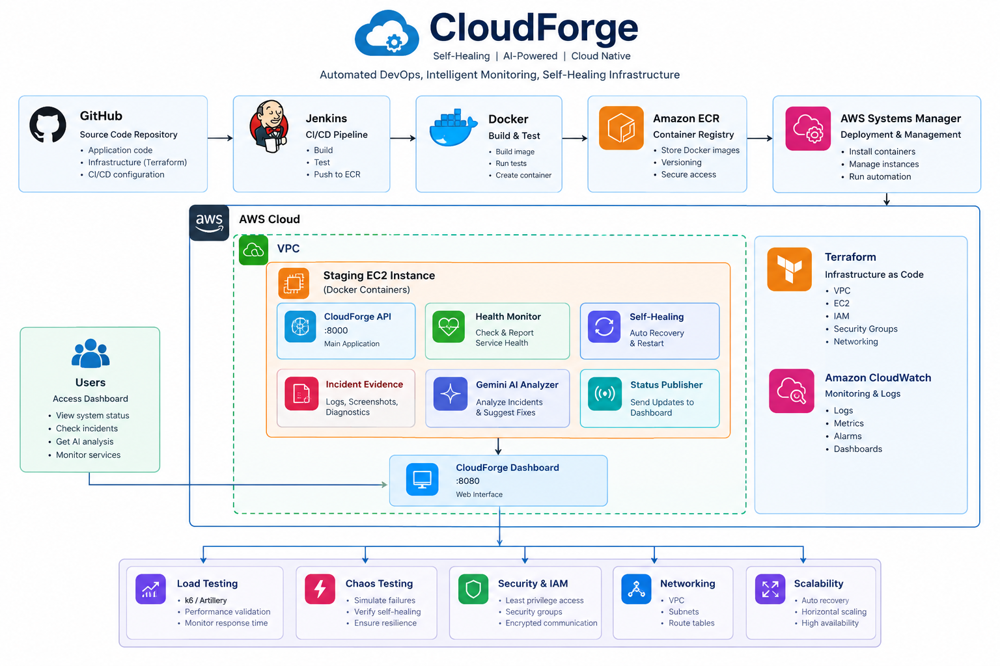

# CloudForge Architecture

## High-Level Architecture



## 1. Overview

CloudForge is a self-healing AWS DevOps/SRE platform designed to demonstrate the complete lifecycle of application delivery, infrastructure automation, monitoring, incident detection, automated recovery, incident analysis, and operational verification.

The platform combines:

- GitHub source control
- Jenkins CI/CD
- Docker containerization
- Amazon ECR
- Terraform infrastructure automation
- Amazon EC2
- AWS Systems Manager
- CloudWatch logging
- Health monitoring
- Automated self-healing
- Incident evidence collection
- Gemini-powered AI incident analysis
- Chaos testing
- Load testing
- A live operational dashboard

The architecture is intentionally divided into separate responsibilities so that application delivery, infrastructure, recovery, incident analysis, and observability do not become tightly coupled.

---

# 2. Architecture Goals

CloudForge is designed around the following goals:

1. Automate application delivery.
2. Manage infrastructure using Terraform.
3. Package the application as a Docker container.
4. Deploy the application to AWS EC2.
5. Detect application failures automatically.
6. Attempt automated recovery.
7. Capture evidence about incidents.
8. Use AI to analyze incident evidence.
9. Expose operational state through a live dashboard.
10. Test reliability through controlled failures and load tests.
11. Keep the project reproducible from GitHub source.
12. Keep temporary AWS resources easy to stop or destroy for learning use.

---

# 3. High-Level Architecture

The current CloudForge architecture can be represented as:

```text
                         Developer
                            |
                            v
                         GitHub
                            |
                            v
                         Jenkins
                            |
                +-----------+-----------+
                |                       |
                v                       v
          Build / Test              Docker Build
                                        |
                                        v
                                  Amazon ECR
                                        |
                                        v
                                AWS Systems Manager
                                        |
                                        v
                                  Staging EC2
                         +--------------+--------------+
                         |                             |
                         v                             v
                  cloudforge-api              cloudforge-dashboard
                      :8000                         :8080
                         |                             |
                         v                             |
                  Health Endpoint                     |
                         |                             |
                         v                             |
                  Health Monitoring                   |
                         |                             |
                         v                             |
                    Self-Healing                      |
                         |                             |
                         v                             |
                 Incident Evidence                    |
                         |                             |
                         v                             |
                 Gemini Analyzer                      |
                         |                             |
                         v                             |
                    AI Analysis ----------------------+
                                                       |
                                                       v
                                                Browser Dashboard
```

---

# 4. Core Lifecycle

The intended CloudForge lifecycle is:

```text
Developer
    |
    v
GitHub
    |
    v
Jenkins CI/CD
    |
    +--> Test
    |
    +--> Docker Build
    |
    +--> Push Image
    |
    v
Amazon ECR
    |
    v
AWS Systems Manager
    |
    v
Staging EC2
    |
    v
CloudForge API
    |
    v
Health Monitoring
    |
    +--> Healthy
    |
    +--> Failure
             |
             v
        Self-Healing
             |
             v
      Recovery Attempt
             |
             v
       Health Verify
             |
        +----+----+
        |         |
     Success    Failure
        |         |
        v         v
   Incident     Failure
    Evidence    Recorded
        |
        v
   AI Analysis
        |
        v
     Dashboard
```

This represents the current implemented operational flow.

---

# 5. Source Control

## GitHub

CloudForge source code is maintained in GitHub.

Repository:

```text
https://github.com/Savio9481/cloudforge.git
```

GitHub contains:

```text
app/
dashboard/
analyzer/
scripts/
tests/
docs/
terraform/
```

The repository is the source of truth for the application, dashboard, automation scripts, tests, infrastructure definitions, and documentation.

---

# 6. CI/CD

## Jenkins

Jenkins is used as the CI/CD controller.

The CloudForge Jenkins pipeline performs the main delivery workflow:

```text
GitHub
   |
   v
Jenkins
   |
   +--> Checkout
   |
   +--> Application Tests
   |
   +--> Docker Build
   |
   +--> Docker Verification
   |
   +--> ECR Push
   |
   +--> SSM Deployment
   |
   +--> Health Verification
   |
   v
Staging
```

The Jenkins pipeline is defined by the project's `Jenkinsfile`.

---

# 7. Containerization

## Docker

The main CloudForge API is packaged as a Docker image.

The application image uses:

```text
Python 3.12 slim
```

The API runs with Uvicorn and listens on:

```text
0.0.0.0:8000
```

The container is named:

```text
cloudforge-api
```

The dashboard is packaged independently as:

```text
cloudforge-dashboard
```

and listens on port `8000` inside its container while being exposed on EC2 port `8080`.

---

# 8. Amazon ECR

The CloudForge API image is stored in Amazon Elastic Container Registry.

Repository:

```text
595319278112.dkr.ecr.us-east-1.amazonaws.com/cloudforge-api
```

The CI/CD process pushes versioned images to ECR.

Example image tag:

```text
195bc75
```

The deployment process can therefore reference a specific application build instead of relying on an unversioned image.

---

# 9. Infrastructure as Code

## Terraform

Terraform manages the AWS infrastructure required by CloudForge.

The repository uses a module-based structure:

```text
terraform/
├── modules/
│   ├── network/
│   └── compute/
└── environments/
    ├── dev/
    └── staging/
```

This separates reusable infrastructure modules from environment-specific configuration.

---

# 10. Network Architecture

The CloudForge infrastructure includes an AWS VPC with environment-specific networking.

The staging environment uses:

```text
VPC
 |
 +--> Public Subnet
 |
 +--> Internet Gateway
 |
 +--> Route Table
 |
 +--> Security Group
 |
 +--> EC2
```

The staging EC2 instance currently runs the CloudForge application and dashboard.

---

# 11. Compute

## Amazon EC2

CloudForge uses Amazon EC2 as the staging compute environment.

The EC2 instance provides the host for:

```text
Docker
CloudForge API
CloudForge Dashboard
CloudForge Monitoring
Self-Healing Scripts
Incident Evidence
AI Analyzer
Jenkins deployment target
```

The project uses AWS Systems Manager for remote administration and deployment rather than requiring SSH access for normal operation.

---

# 12. AWS Systems Manager

AWS Systems Manager is used for remote instance access and deployment operations.

The main mechanism used by CloudForge is:

```text
SSM Session Manager
```

and SSM-based commands from Jenkins.

This allows Jenkins to deploy to the EC2 instance without exposing an SSH management workflow.

The EC2 instance uses an IAM instance profile with the required Systems Manager permissions.

---

# 13. IAM

CloudForge uses IAM roles and policies to allow AWS services and EC2 to perform required operations.

The EC2 instance uses an instance profile associated with:

```text
AmazonSSMManagedInstanceCore
```

This allows the instance to communicate with AWS Systems Manager.

The CI/CD workflow also requires appropriate AWS permissions for operations such as:

```text
ECR authentication
ECR image push
SSM command execution
```

Permissions should remain scoped to the resources required by the project.

---

# 14. Security Groups

The staging security group controls inbound network access.

The current dashboard/API setup uses:

```text
TCP 8000 → CloudForge API
TCP 8080 → CloudForge Dashboard
```

These ports are used for the staging demonstration.

For a production deployment, these services should normally be placed behind an appropriate secured entry point rather than exposing application ports directly.

---

# 15. Application Layer

The main application is the CloudForge API.

Its primary health endpoint is:

```text
GET /health
```

Expected healthy response:

```json
{
  "status": "healthy",
  "version": "1.0.0"
}
```

The health endpoint is used by:

- Docker health checks
- CloudForge monitoring
- Jenkins deployment verification
- Manual verification
- Chaos testing

---

# 16. Monitoring Layer

CloudForge contains a monitoring loop that periodically checks:

```text
http://127.0.0.1:8000/health
```

The monitor runs the health check repeatedly.

The simplified flow is:

```text
Monitor
   |
   v
Health Check
   |
   +---- Healthy ----> Continue Monitoring
   |
   +---- Failed ------> Start Self-Healing
```

This monitoring layer is intentionally independent of the dashboard.

---

# 17. Self-Healing Layer

The self-healing mechanism attempts to recover failures that can be resolved by restarting the application container.

The recovery flow is:

```text
Health Check Failure
        |
        v
Collect Evidence
        |
        v
Inspect Container
        |
        v
Restart Container
        |
        v
Wait for Health
        |
        v
Health Verification
        |
        +---- Success
        |
        +---- Failure
```

The current recovery action is primarily:

```text
docker start
```

with restart fallback logic.

---

# 18. Self-Healing Boundary

CloudForge currently demonstrates container-level self-healing.

For example:

```text
Container stopped
       |
       v
Health check fails
       |
       v
Self-healing starts container
       |
       v
Health returns
```

This has been verified through controlled chaos tests.

However, the current implementation does not automatically solve every type of infrastructure failure.

For example:

```text
Firewall blocks port 8000
       |
       v
Health check fails
       |
       v
Container restart
       |
       v
Still blocked
```

The network failure remains until the firewall condition is removed.

This boundary is intentionally documented rather than presenting container restart as a universal remediation system.

---

# 19. Incident Evidence

When a failure is detected, CloudForge collects operational evidence.

Evidence can include:

```text
Container status
Exit code
OOMKilled state
Restart count
Container logs
Host kernel logs
Detection time
Recovery time
Recovery action
Recovery status
```

The incident is stored as JSON under:

```text
/opt/cloudforge/incidents/
```

Example:

```text
incident-<timestamp>.json
```

---

# 20. Incident Lifecycle

The incident lifecycle is:

```text
Failure
   |
   v
Detection
   |
   v
Evidence Collection
   |
   v
Recovery Attempt
   |
   v
Health Verification
   |
   v
Incident Record
   |
   v
AI Analysis
   |
   v
Dashboard
```

This provides an auditable sequence from failure to recovery.

---

# 21. AI Incident Analyzer

CloudForge includes an AI incident analyzer using Google's Gemini API.

The analyzer reads an incident JSON record and generates an analysis based on the evidence contained in that incident.

The analyzer considers:

```text
What happened
Likely cause
Impact
Recovery performed
Recovery assessment
Recommended next actions
```

The analyzer is instructed to distinguish confirmed evidence from uncertainty and not claim an exact root cause when the available evidence does not establish one.

---

# 22. AI Analyzer Architecture

The analyzer is separate from the API and dashboard.

```text
Incident JSON
     |
     v
AI Analyzer
     |
     v
Gemini
     |
     v
AI Report
     |
     v
/opt/cloudforge/incidents/
     |
     v
Dashboard
```

The analyzer uses its own Python virtual environment and dependency set.

This prevents the main API and dashboard images from unnecessarily including the Gemini SDK.

---

# 23. Runtime Status Publisher

CloudForge maintains a runtime status file:

```text
/opt/cloudforge/runtime/status.json
```

The status publisher runs as:

```text
cloudforge-status-publisher.service
```

It continuously publishes the current API container state.

The dashboard consumes this information in read-only mode.

---

# 24. Dashboard Architecture

The dashboard is a separate container:

```text
cloudforge-dashboard
```

It runs on:

```text
EC2 :8080
```

and maps to:

```text
Container :8000
```

The dashboard exposes:

```text
/dashboard/
/api/dashboard
/api/container
```

The dashboard reads:

```text
Runtime status
Incident records
AI reports
System metrics
```

The dashboard does not own the self-healing process.

---

# 25. Dashboard Data Flow

```text
Docker
   |
   v
Status Publisher
   |
   v
runtime/status.json
   |
   v
Dashboard Backend
   |
   +--> Container State
   |
   +--> Incident Data
   |
   +--> AI Analysis
   |
   +--> System Metrics
   |
   v
Browser
```

The dashboard is therefore a visibility layer rather than a privileged recovery engine.

---

# 26. Dashboard and Recovery Separation

CloudForge deliberately separates:

```text
Self-Healing
    |
    +--> Controls recovery

Dashboard
    |
    +--> Shows operational state

AI Analyzer
    |
    +--> Analyzes incident evidence
```

This reduces the need for the dashboard to have privileged Docker control.

The dashboard does not require:

```text
/var/run/docker.sock
```

to perform its normal monitoring role.

---

# 27. CloudWatch

CloudWatch is part of the CloudForge observability architecture.

The project uses CloudWatch logging for application/deployment visibility.

The staging log group used by the project is:

```text
/cloudforge/staging
```

CloudWatch complements the local incident evidence collected by the self-healing scripts.

---

# 28. Observability Layers

CloudForge therefore has multiple observability sources:

```text
Application
    |
    +--> /health

Docker
    |
    +--> Container state
    +--> Container logs
    +--> Health state

Host
    |
    +--> CPU
    +--> Memory
    +--> Kernel logs

CloudWatch
    |
    +--> Centralized logs

Incident System
    |
    +--> JSON evidence

AI Analyzer
    |
    +--> Incident interpretation

Dashboard
    |
    +--> Operational visibility
```

---

# 29. Testing Architecture

CloudForge includes two important reliability testing approaches.

## Chaos Testing

Controlled failures are intentionally introduced to verify:

```text
Detection
Recovery
Evidence collection
Recovery limitations
```

## Load Testing

The API is tested under concurrent request load to measure:

```text
Successful requests
Failed requests
Average latency
Requests per second
```

These tests help demonstrate both failure recovery and normal runtime behavior.

---

# 30. Chaos Testing Flow

The controlled chaos flow is:

```text
Normal Application
       |
       v
Intentional Failure
       |
       v
Health Check Failure
       |
       v
Self-Healing
       |
       v
Container Recovery
       |
       v
Health Verification
       |
       v
Incident Record
       |
       v
AI Analysis
       |
       v
Dashboard
```

Examples tested include:

```text
docker stop cloudforge-api
docker kill cloudforge-api
```

A controlled firewall failure was also tested to identify the current self-healing boundary.

---

# 31. Load Testing Flow

The load-testing architecture is:

```text
Load Test Script
       |
       v
CloudForge /health
       |
       v
Docker Container
       |
       v
Response Metrics
```

The project has tested request loads up to:

```text
5,000 requests
50 concurrent workers
```

The tests were successful during the documented staging benchmark, with zero failed requests in the recorded runs.

The detailed measurements are documented separately in:

```text
docs/load-testing.md
```

---

# 32. Deployment Architecture

The current deployment flow is:

```text
Developer
    |
    v
GitHub
    |
    v
Jenkins
    |
    v
Docker Build
    |
    v
Amazon ECR
    |
    v
AWS Systems Manager
    |
    v
Staging EC2
    |
    +--> Pull image
    |
    +--> Start cloudforge-api
    |
    +--> Verify /health
    |
    v
Deployment Complete
```

The dashboard is deployed separately from the API image.

---

# 33. Environment Separation

Terraform separates environments under:

```text
terraform/environments/
```

Current structure:

```text
dev/
staging/
```

The goal is to avoid hard-coding a single environment into reusable infrastructure modules.

The environment-specific configuration supplies values such as:

```text
Environment name
AMI
Instance type
Subnet
Security group
IAM profile
Storage
```

---

# 34. Dev Environment

The development environment provides infrastructure used for CloudForge development and CI/CD operations.

The Dev EC2 environment has been used for:

```text
Jenkins
CI/CD
AWS CLI
Terraform
Deployment orchestration
```

---

# 35. Staging Environment

The staging environment is the main application demonstration environment.

It contains:

```text
cloudforge-api
cloudforge-dashboard
Monitoring
Self-Healing
Incident Evidence
AI Analyzer
```

This environment is used for:

```text
Deployment testing
Chaos testing
Load testing
Dashboard verification
Recovery verification
```

---

# 36. Current Implemented Architecture vs Future Architecture

Not every concept in the original CloudForge vision is currently implemented as an active production component.

The current implementation includes:

```text
GitHub
Jenkins
Docker
ECR
Terraform
EC2
SSM
CloudWatch logging
Health Monitoring
Self-Healing
Incident Evidence
Gemini AI Analyzer
Live Dashboard
Chaos Testing
Load Testing
```

The following are future architecture directions rather than components that should be represented as currently deployed:

```text
Application Load Balancer
Advanced Policy Engine
Automated Rollback
Multi-stage production promotion
More advanced remediation actions
```

These belong to the CloudForge roadmap unless and until they are implemented.

---

# 37. Application Load Balancer

An Application Load Balancer is part of the broader planned architecture.

A future deployment could use:

```text
Internet
   |
   v
Application Load Balancer
   |
   v
Target Group
   |
   v
CloudForge EC2 / Service
```

The current staging demonstration does not require an ALB.

Therefore the current architecture should not describe ALB traffic as an active deployment path.

---

# 38. Automated Rollback

Automated rollback is a future extension of the recovery architecture.

The current recovery system primarily performs:

```text
Container Restart
```

A future policy engine could evaluate:

```text
Restart
Rollback
Replace
Redeploy
Scale
Escalate
```

based on incident evidence and deployment state.

Until implemented, rollback should be treated as a roadmap capability rather than a current CloudForge behavior.

---

# 39. Policy Engine

A future policy engine could sit between:

```text
Incident Detection
```

and:

```text
Remediation
```

For example:

```text
Incident
   |
   v
Evidence
   |
   v
Policy Engine
   |
   +--> Restart
   |
   +--> Rollback
   |
   +--> Redeploy
   |
   +--> Escalate
```

The current CloudForge implementation does not yet implement this generalized policy engine.

---

# 40. Security Architecture

CloudForge follows several security boundaries:

```text
GitHub
   |
   v
Jenkins
   |
   v
ECR
   |
   v
SSM
   |
   v
EC2
```

The dashboard receives read-only access to operational evidence.

The dashboard does not need direct Docker daemon access.

The Gemini API key is stored as an environment variable rather than hard-coded into source code.

Secrets should never be committed to GitHub.

---

# 41. Failure Handling Philosophy

CloudForge treats recovery as an evidence-driven process.

The basic sequence is:

```text
Detect
  |
  v
Inspect
  |
  v
Recover
  |
  v
Verify
  |
  v
Record
  |
  v
Analyze
```

This is preferable to simply restarting a container and assuming that the system recovered successfully.

CloudForge explicitly checks health after the recovery action.

---

# 42. Recovery Verification

A recovery is considered successful only when the application becomes healthy again.

The verification target is:

```text
http://127.0.0.1:8000/health
```

The recovery process records:

```text
Detected time
Recovered time
Recovery duration
Recovery action
Recovery status
Health status
```

This makes recovery measurable rather than merely attempted.

---

# 43. Architecture Principles

The CloudForge architecture follows these principles:

### Separation of responsibilities

```text
CI/CD      → Delivery
Terraform  → Infrastructure
Docker     → Packaging
EC2        → Compute
SSM        → Management
Monitor    → Detection
Self-Heal  → Recovery
Incident   → Evidence
AI         → Analysis
Dashboard  → Visibility
```

### Evidence before interpretation

The AI analyzer receives incident evidence rather than inventing an incident narrative independently.

### Recovery before success

A restart is not considered successful until the health check confirms recovery.

### Reproducibility

Infrastructure and application components are stored in Git and rebuilt from source.

### Controlled experimentation

Chaos and load tests are performed intentionally in the staging environment.

---

# 44. End-to-End Architecture

The complete current architecture can be summarized as:

```text
                         +----------------+
                         |    Developer   |
                         +-------+--------+
                                 |
                                 v
                         +----------------+
                         |     GitHub     |
                         +-------+--------+
                                 |
                                 v
                         +----------------+
                         |    Jenkins     |
                         +-------+--------+
                                 |
                  +--------------+--------------+
                  |                             |
                  v                             v
             Build/Test                    Docker Build
                                                |
                                                v
                                         +-------------+
                                         |     ECR     |
                                         +------+------+
                                                |
                                                v
                                         +-------------+
                                         |     SSM     |
                                         +------+------+
                                                |
                                                v
                              +-----------------+-----------------+
                              |           Staging EC2             |
                              |                                   |
                              |  +-----------------------------+  |
                              |  |       cloudforge-api        |  |
                              |  |            :8000             |  |
                              |  +--------------+--------------+  |
                              |                 |                 |
                              |                 v                 |
                              |          Health Monitor          |
                              |                 |                 |
                              |                 v                 |
                              |          Self-Healing            |
                              |                 |                 |
                              |                 v                 |
                              |       Incident Evidence          |
                              |                 |                 |
                              |                 v                 |
                              |          Gemini Analyzer         |
                              |                 |                 |
                              |                 v                 |
                              |             AI Report            |
                              |                                   |
                              |  +-----------------------------+  |
                              |  |     cloudforge-dashboard    |  |
                              |  |            :8080             |  |
                              |  +--------------+--------------+  |
                              |                 |                 |
                              +-----------------+-----------------+
                                                |
                                                v
                                             Browser
```

---

# 45. Operational Visibility

The dashboard provides a single operational view of:

```text
Application
Environment
Container
Health
CPU
Memory
Incident
Recovery
AI Analysis
```

This allows the project to demonstrate how application state, infrastructure state, recovery state, and incident intelligence can be presented together.

---

# 46. Architecture Verification

The architecture is considered verified when the following are true:

```text
[ ] Terraform validates
[ ] Terraform plan matches infrastructure
[ ] Application container builds
[ ] Application container is healthy
[ ] Dashboard image builds from dashboard/
[ ] Dashboard container is healthy
[ ] Dashboard returns HTTP 200
[ ] Dashboard API returns live data
[ ] Runtime status is published
[ ] Incident records are generated
[ ] AI analysis is generated
[ ] Self-healing recovers tested container failures
[ ] Load tests complete successfully
[ ] Chaos tests document recovery boundaries
```

---

# 47. Final Architecture Summary

CloudForge is structured as an end-to-end AWS DevOps/SRE platform:

```text
Source
  ↓
Build
  ↓
Package
  ↓
Store
  ↓
Deploy
  ↓
Monitor
  ↓
Detect
  ↓
Recover
  ↓
Verify
  ↓
Record
  ↓
Analyze
  ↓
Visualize
```

The key architectural separation is:

```text
CI/CD
    → delivers software

Terraform
    → provisions infrastructure

Monitoring
    → detects failures

Self-Healing
    → performs recovery

Incident System
    → records evidence

AI Analyzer
    → analyzes evidence

Dashboard
    → provides visibility
```

This architecture represents the currently implemented CloudForge platform while keeping planned capabilities such as an Application Load Balancer, generalized policy engine, and automated rollback clearly identified as future extensions.
